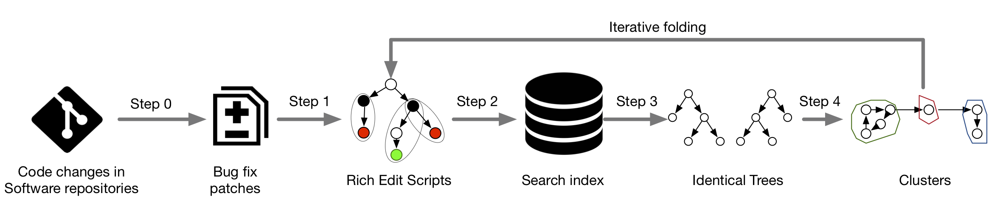

# FixMiner [](https://coveralls.io/github/SerVal-DTF/fixminer_source?branch=master)

# Code of FixMiner

Reference: [FixMiner: Mining Relevant Fix Patterns for Automated Program Repair](http://arxiv.org/pdf/1810.01791) (Empirical Software Engineering, [doi:10.1007/s10664-019-09780-z](https://doi.org/10.1007/s10664-019-09780-z))
## Citing FixMiner

You can cite FixMiner using the following bibtex:

```
@article{koyuncu2020fixminer,
  title={Fixminer: Mining relevant fix patterns for automated program repair},
  author={Koyuncu, Anil and Liu, Kui and Bissyand{\'e}, Tegawend{\'e} F and Kim, Dongsun and Klein, Jacques and Monperrus, Martin and Le Traon, Yves},
  journal={Empirical Software Engineering},
  pages={1--45},
  year={2020},
  publisher={Springer}
}
  ```
# FixMiner

* [I. Introduction of FixMiner](#user-content-i-introduction)
* [II. Environment setup](#user-content-ii-environment)
* [III. Replication Data](#user-content-iii-data)
* [IV. Step-by-Step execution](#user-content-iv-how-to-run)
<!--
* [V. Evaluation Result](#user-content-v-evaluation-result)
* [VI. Generated Patches](#user-content-vi-generated-patches)
* [VII. Structure of the project](#user-content-vii-structure-of-the-project)
-->

## I. Introduction

Fixminer is a systematic and automated approach to mine relevant and actionable fix patterns for automated program repair.


## II. Environment setup

* OS: macOS Mojave (10.14.3)
* JDK8: (**important!**)
* To mine from c code, [srcml 1.0.0](https://www.srcml.org/#download)
* Download and configure Anaconda
* Create an python environment using the [environment file](environment.yml)
  ```powershell
  conda env create -f environment.yml
  ```
* After creating the environment, activate it. It is containing necessary dependencies for redis, and python.
  ```powershell
  source activate fixminerEnv
  ```

* Update the config.yml file with the corresponding paths in your computer. An example config.yml file could be found under
  ```powershell
  fixminer_source/src/main/resources/config.yml
  ```
<!---
[fixminer.sh](python/fixminer.sh)

Unzip it,to the datasetPath path indicated in app.properties.

    7z x allDataset.7z
    
In order to launch FixMiner, execute [fixminer.sh](python/fixminer.sh)

    bash fixminer.sh /Users/..../enhancedASTDiff/python/ stats
--->

## IV. Step-by-Step execution

#### Before running

* Update [config file](src/main/resources/config.yml) with corresponding user paths.

* Active the conda environment from shell
  ```powershell
  source activate fixminerEnv
  ```

In order to launch FixMiner, execute [fixminer.sh](python/fixminer.sh)

    bash fixminer.sh [JOB] [CONFIG_FILE]
     e.g. bash fixminer.sh  dataset4c /Users/projects/release/fixminer_source/src/main/resources/config.yml

    
#### Job Types  

*FixMiner* needs to specify a job to run.

   1. __dataset4j__ / __dataset4c__: Create a java/c mining dataset from the projects listed in [subjects.csv](python/data/subjects.csv) or [datasets.csv](python/data/datasets.csv) for c
      
   2. __richEditScript__: Calls the jar file produced as the results as maven package to compute Rich edit scripts.
   This step can be invoke natively from java or using the [Launcher](src/main/java/edu/lu/uni/serval/richedit/Launcher.java) with appropriate arguments.

         ```powershell
         java -jar FixPatternMiner-1.0.0-jar-with-dependencies.jar  /Users/projects/release/fixminer_source/src/main/resources/config.yml RICHEDITSCRIPT
         ```   
   3. __shapeSI__: Search index creation for shapes. The output of this step is written to __pairs__ folder which will be generated under __datapath__ in [config file](src/main/resources/config.yml)
    
   4. __compare__ : Calls the jar file produced as the results as maven package to compare the trees.
                             This step can be invoke natively from java or using the [Launcher](src/main/java/edu/lu/uni/serval/richedit/Launcher.java) with appropriate arguments.
                             
                           ```powershell
                           java -jar FixPatternMiner-1.0.0-jar-with-dependencies.jar  /Users/projects/release/fixminer_source/src/main/resources/config.yml COMPARE
                          
                           ```     
   5. __cluster__ : Forms clusters of identical trees. The output of this step is written to __shapes__ folder which will be generated under __datapath__ in [config file](src/main/resources/config.yml)
                                                                                                                   
   <!--
    
    6. 'actionSI': Search index creation for actions. The output of this step is written to [pairs](python/data/pairsAction)
    
    7. 'compareActions' : ActionTree comparison
    
    8. 'clusterActions': Forms clusters of identical ActionTree. The output of this step is written to [shapes](python/data/actions)
    
    9. 'tokenSI': Search index creation for shapes. The output of this step is written to [pairs](python/data/pairsToken)
    
    10. 'compareTokens' : TokenTree comparison
    
    11. 'clusterTokens': Forms clusters of identical TokenTree. The output of this step is written to [shapes](python/data/tokens)
    
    12. 'stats' : Calculate some statistics about patterns under python/data/statsactions.csv,statsshapes.csv,statstokens.csv, and export FixPatterns of APR integration [fixpatterns](actionPattern2verify.csv)
    
   -->

<!--
App.properties:


FixMiner consists of several jobs that needs to run in order to extract fix pattern from the dataset.
It is necessary to run the FixMiner, following the order.
  1.ENHANCED AST DIFF calcuation

    By setting the jobType = ENHANCEDASTDIFF. This will create the ENHANCEDASTDIFF for the dataset regardless of the actionType.

  2.CACHE the enhanced AST Diff into memory cache

    By setting the jobType = CACHE
    
  3.SI search index construction.
  
    By setting the jobType = SI
    
  4.SIMI in order to compare the similarity between the trees.
  
    By setting the jobType = SIMI

  5.LEVEL1 mining

    By setting the jobType = LEVEL1

  6.LEVEL2 mining

    By setting the jobType = LEVEL2

  7.LEVEL3 mining

    By setting the jobType = LEVEL3
    
    
 A mining is iteration is executed for the actionType. In order to execute for all the actionTypes, the iteration should be repeated from 2-7 by changing the actionType.
    
  There are some additional parameters in the app.config. 
  
  actionType
    
    The admitted values are UPD,INS,DEL,MOV,MIX, which represents the ENHANCEDASTDIFF actions.
    UPD/INS/DEL/MOV considers tree where a single action operation is done in the action set
    MIX considers any action.
  
  parallelism
    
    The engine to use for parallelism. It is either FORKJOIN or AKKA. 
    FORKJOIN is recommended is the FixMiner is running on a single machine. 
    AKKA is suggested for distributed machines.
    
  numOfWorkers
  
    The number of workers that will be generated when AKKA is selected as the parallelism engine.
    
  cursor
  
    The maximum number of pairs in during the search index SI creation.
    
   eDiffTimeout
   
    The timeout value in seconds for the Enhanced Diff computation (ENHANCEDASTDIFF). 
    In case ENHANCEDASTDIFF step logs timeouts, this value can be increase. 
    
    
   The following parameters should be used when dealing with extremely large dataset. Otherwise, default values are suggested.
    
   isBigPair
    
    This flag when set to true, splits the pairs that into chunks as ..0.txt,1.txt etc. 
    
   chunk
   
    The extension of the pairs files. When isBigPair is set to false(which is default), it needs to be set as .csv 
    When isBigPair mode is activated then the SIMI step executed for each chunk by stepping the chunk as 0.txt, 1,txt) 

    
## V. Evaluation Result
## VI. Generated Patches
## VII. Structure of the project
--> 
    
<!--
    
## III. Replication Data
Replication Data:
    
   [singleBR.pickle](python/data/singleBR.pickle)
    
    This pickle contains the list bug reports (i.e. bid) with the their corresponding fixes (i.e. commit) for each project in the dataset (i.e. project). 
    
   [bugReports.7z.00X](python/data/bugReports.7z.001)
   
    This is the dump of the bug reports archive extracted from each commit. These bug reports are not necessarily considered as BUG,CLOSED; this archive is the contins initial bug reports before identifying the fixes. 
    
   [gumInput.7z.001](python/data/gumInput.7z.001)
   
    This archive contains all the patches in our dataset, formatted in a way that can be processed by GumTree (i.e DiffEntries, prevFiles, revFiles)
    
   [ALLbugReportsComplete.pickle](python/data/ALLbugReportsComplete.pickle)
   
    The pickle object that represents the bug reports under the following columns 'bugReport', 'summary', 'description', 'created', 'updated', 'resolved', 'reporterDN', 'reporterEmail','hasAttachment', 'attachmentTime', 'hasPR', 'commentsCount'
-->

#### Data Viewer

The data provided with replication package is listed in directory [python/data](python/data)
The data is stored in different formats. (e.g. pickle, db, csv, etc..)

The see content of the .pickle file the following script could be used.

  ```python
   import pickle as p
   import gzip
   def load_zipped_pickle(filename):
      with gzip.open(filename, 'rb') as f:
          loaded_object = p.load(f)
          return loaded_object
  ```
Usage

  ```python
  result = load_zipped_pickle('code/LANGbugReportsComplete.pickle')
  # Result is pandas object which can be exported to several formats
  # Details on how to export is listed in offical library documentation
  # https://pandas.pydata.org/pandas-docs/stable/reference/api/pandas.DataFrame.html

  ```

